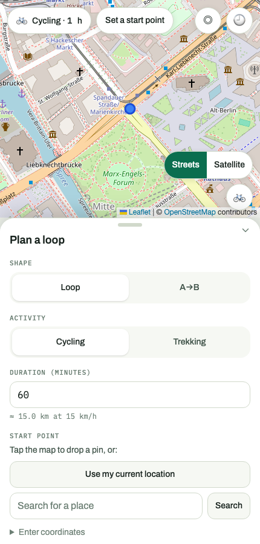
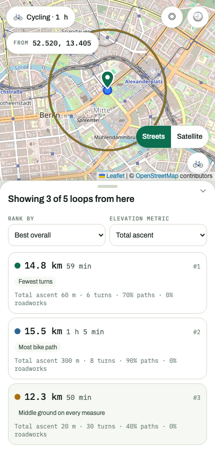
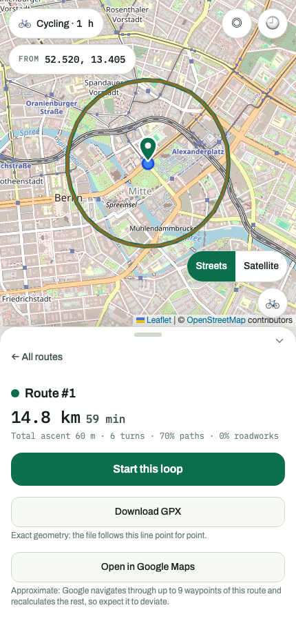

# TrekkPilot

TrekkPilot plans cycling and trekking routes from the time that you have, not
from the place that you go to. You tell it that you have one hour. It finds
three loops from your position, and scores them on ascent, turns, and the share
of the route on dedicated bike paths. Then it gives you the loop that you select
as a GPX file or as a Google Maps link.

Point-to-point mode also works. You name a start and a destination, and
TrekkPilot ranks three ways to get there.

<p>
  
  
  
</p>

## What it does

- **Loop routes from a time budget.** The duration and the activity give a
  target distance (15 km/h for cycling, 4.5 km/h for trekking). This distance
  drives the `round_trip` mode of OpenRouteService.
- **Three ranked candidates.** Each search makes five seeded round-trip calls.
  The best three come back with a score. The score uses total ascent, turn
  count, the share of the route on cycleway or footway, and a construction
  penalty.
- **Re-rank without a new request.** Every candidate carries every metric. When
  you change the target (flattest, gentlest climbs, most bike path, fewest
  turns), the client puts the three in a new order immediately.
- **Point-to-point alternatives** between two named or searched locations.
- **Live position** on the active route while the app is in the foreground. A
  toggle controls the follow mode. There is no background tracking.
- **Exports.** The GPX file reproduces the scored geometry exactly, for Komoot
  or any GPX-compatible app. The Google Maps link is an approximation, because
  Google calculates the directions again through nine waypoints or fewer.
- **History** in `localStorage`. The data stays on the device. There is no
  account and no backend storage.

## How it works

TrekkPilot is a TanStack Start app. The OpenRouteService API key stays in the
server functions and never gets to the browser. The checks that follow grep the
`pnpm build` output for this key.

```
src/
  routes/index.tsx      the whole app: map, pill bar, bottom sheet
  components/           map canvas, sheet panels, controls
  lib/                  pure client logic: ranking, formatting, sheet state,
                        route history, GPX and Google Maps builders
  server/               ORS calls, scoring, geocoding
    functions/          server-function boundary (the API key stops here)
```

The UI is map-first and mobile-first. A full-bleed map holds a floating pill bar
and a bottom sheet. From the `md` breakpoint up, the sheet becomes a floating
card. The state of the sheet comes from intent plus data, and the app does not
store it. Thus the sheet cannot stay on an empty view.

Scoring is one weighted sum in `src/server/scoring.ts`. The weights favor
flatter routes with fewer turns and more dedicated paths.

| Term                         | Weight |
| ---------------------------- | ------ |
| Ascent (for each meter)      | −0.05  |
| Turns (for each maneuver)    | −0.5   |
| Cycleway/footway ratio (0–1) | +50    |
| Construction ratio (0–1)     | −100   |

The elevation term can use total ascent, net elevation change, or max gradient.
The server uses this term to select the top three. The client then ranks these
three again.

## Setup

You need Node 24 and pnpm. Development used pnpm 11, and CI uses Node 24.

Install the dependencies:

```bash
pnpm install
```

You also need an OpenRouteService API key. The free tier is sufficient.

1. Create an account from the
   [ORS developer login](https://openrouteservice.org/dev/#/login).
2. Generate a token on the
   [dashboard](https://openrouteservice.org/dev/#/home).
3. Put the token in a `.env` file in the root of the repository.

Note: ORS accounts use HeiGIT Account. Thus the login can send you to
`account.heigit.org`.

```bash
echo 'ORS_API_KEY=your-key-here' > .env
```

Git ignores `.env`, and only the server reads the key. An environment variable
does the same job if you do not want a file:

```bash
ORS_API_KEY=your-key-here pnpm dev
```

Then start the dev server:

```bash
pnpm dev          # http://localhost:3000
```

Without a key, the app loads and the map shows, but every search fails. The
server function throws `ORS_API_KEY is not configured on the server`.

`ORS_BASE_URL` sends these requests to a different host. The default is
`https://api.openrouteservice.org`, thus production needs no value. This
variable lets a test point the app at a fixture ORS server (`e2e/fixtures/`) and
do the full journey. Such a test needs no key, no network access, and no
free-tier quota. Only the server reads this variable, as it reads the API key.
The Playwright suite sets it for you. For more data, read _Testing and quality
gates_.

The free tier has a rate limit. Each loop search spends **five** directions
requests, one for each seed. Each location that you search by name spends one
more geocoding request.

## Scripts

| Command                | What it does                                |
| ---------------------- | ------------------------------------------- |
| `pnpm dev`             | Dev server on port 3000                     |
| `pnpm build`           | Production build                            |
| `pnpm preview`         | Serve the production build                  |
| `pnpm test`            | Vitest in watch mode                        |
| `pnpm test:run`        | Vitest one time                             |
| `pnpm coverage`        | Vitest with coverage                        |
| `pnpm e2e`             | Playwright against a preview build          |
| `pnpm e2e:smoke`       | The `@smoke` subset of the Playwright tests |
| `pnpm typecheck`       | `tsc -b`                                    |
| `pnpm lint`            | oxlint, type-aware                          |
| `pnpm lint:fix`        | oxlint with `--fix`                         |
| `pnpm format`          | Prettier over the repository                |
| `pnpm knip`            | Find unused files, exports and dependencies |
| `pnpm generate-routes` | Generate `src/routeTree.gen.ts` again       |

Add route files to `src/routes`. TanStack Router then generates
`src/routeTree.gen.ts` for you. The `#/*` imports map to `./src/*`.

## Testing and quality gates

The suite has unit and integration tests in Vitest with Testing Library. A
Playwright suite runs against a real production preview build. In Vitest, a mock
replaces ORS at the `fetch` boundary. The tests cover scoring, ranking, GPX, and
history as pure functions.

End to end, a local fixture server (`e2e/fixtures/`) replaces ORS. This server
uses `node:http` only and has no dependencies. `e2e/global-setup.ts` starts it
for the run. The tests get to it because `playwright.config.ts` sets
`ORS_BASE_URL` and a dummy `ORS_API_KEY` for the preview server.

The fixtures reproduce real ORS GeoJSON field for field: `[lon, lat, elevation]`
coordinate triples, `summary`, `segments[].steps[]`, and
`extras.waytype.summary[]` with the numeric waytype codes of ORS. The five loop
candidates differ enough in ascent, turns, and waytype mix that the top-three
cut and the ranking control both do real work. As a result, `pnpm e2e` covers
the search, the re-ranking, the selection, the GPX export, the Google Maps link,
the history, and the point-to-point flow. It spends no key, no network access,
and no quota. `pnpm e2e:smoke` runs the `@smoke` subset.

A husky pre-commit hook runs lint-staged, `tsc -b`, and the full Vitest suite.
Thus a commit cannot land red. CI also runs coverage, `knip`, and the Playwright
job.

## Known limitations

- **Some ORS response details are a belief, not a proven fact.** Search works
  against a live key, but a few specifics have only run against our own
  fixtures. We wrote those fixtures to match what the code reads. Thus they
  record the current belief and do not prove it. These specifics are the numeric
  `waytype` codes behind the path-type ratio and the construction penalty, the
  response that carries `properties.extras` and not `extra_info`, the `api_key`
  query parameter on `/geocode/search`, and the `share_factor` and
  `weight_factor` values for `alternative_routes`.
- **A wrong belief degrades a metric, it does not break a search.** The API
  gives no dedicated `construction=*` bucket, thus the code uses one waytype
  code for both signals. Missing or misread data makes one scoring signal worse,
  but it does not stop a search. Thus a wrong guess shows a metric that is
  always 0%, and not an error.
- **Net elevation change is almost zero for loops**, by definition. This metric
  is most useful in point-to-point mode.
- **Point-to-point mode ignores the time budget.** It ranks three ways to a
  destination, and it does not limit them by duration.
- **Return trips are out of scope.** The app routes the outbound leg only.
- The OSM attribution can go behind the bottom sheet on a phone. The drag handle
  of the sheet looks like a control, but it has no drag gesture yet.

## Docs

`docs/done/` holds the specs that the app was built from. There is one file for
each shipped slice, in implementation order.
